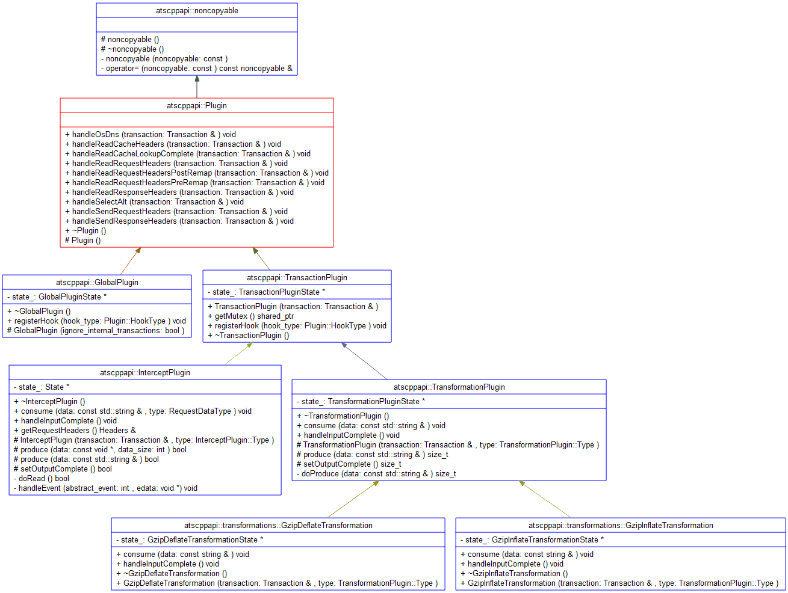
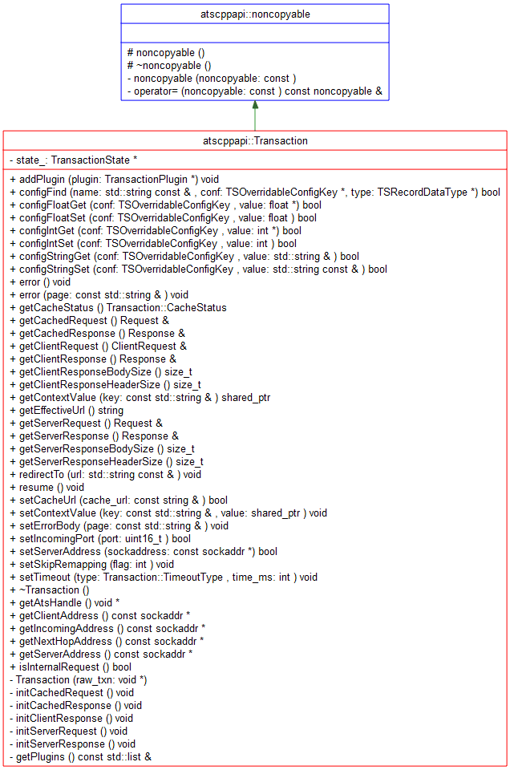

# cpp api design
## plugin type 
从功能上分可以分为：

 1. Global plugin    全局插件
 2. TransactionPlugin 会话插件
 
 其中

## class Plugin  
 

可供选择的钩子如下下面代码，每一个事件在plugin 基类中都能找到对应的虚函数。如果注册了对应的事件，只需要实现对应的虚函数即可。
* HOOK_READ_REQUEST_HEADERS_PRE_REMAP  在remap 之前就被触发。
* HOOK_READ_REQUEST_HEADERS_POST_REMAP   在remap 之后被触发。
* HOOK_SEND_REQUEST_HEADERS  在发送给源站请求之前被触发。
* HOOK_READ_RESPONSE_HEADERS  在源站响应头信息到达之后触发
* HOOK_SEND_RESPONSE_HEADERS  在发送给客户端响应之前触发
* HOOK_OS_DNS  在DNS查询之后触发
* HOOK_READ_REQUEST_HEADERS  在头信息被读取出来后触发
* HOOK_READ_CACHE_HEADERS  在缓存的头信息被读取出来之后触发  
* HOOK_CACHE_LOOKUP_COMPLETE 在缓存读取完之后触发
* HOOK_SELECT_ALT 多副本选择的时候触发

具体捕获到对应的事件后，可以通过Transaction &transaction 对象进行设置 和更改，具体的内容如下：
 
该类 可做如下更改

* 